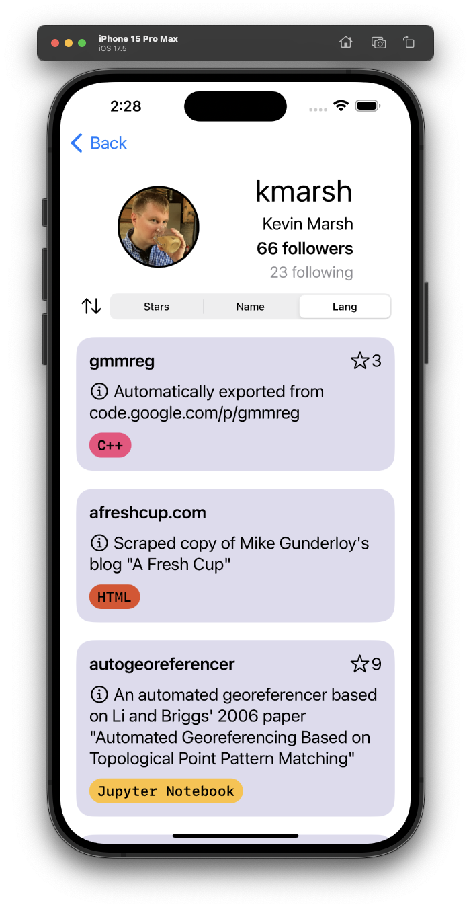

# GitHubBrowser

## Features of Note

- The repository screen features the ability to sort by number of stars, repo name and programming language.

- Usability and design are front and center.

## Rate Limit

You'll need to enter your own GitHub access token. This can be done by navigating to [line 135](https://github.com/TheNorthEestern/GitHubBrowser/blob/main/GHBrowser/Service/GitHubV3Service.swift#L135) of `GitHubV3Service` and filling f34af269b9f4e41e4dcfd0aa67246328195345b9our token.

```swift
request.setValue(.bearerAuthorization(token: "<YOUR_TOKEN_HERE>"), field: .authorization)
```

